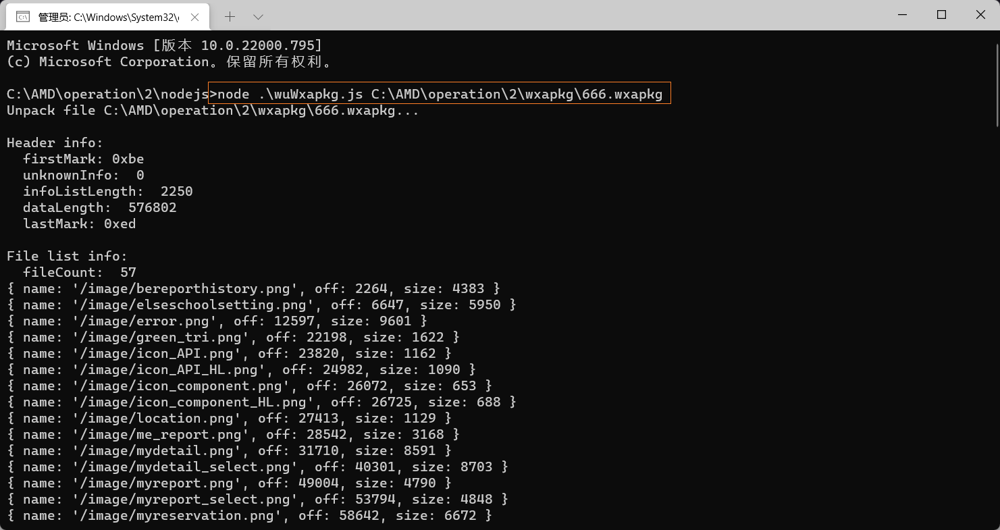

### 第一步:电脑端提取

* 略

### 第二步:解密wxapkg包

* 工具下载地址
  * https://github.com/superBiuBiuMan/wechatMiniAppReverse
* 工具的使用

```bash
pc_wxapkg_decrypt.exe -wxid 微信小程序id -in 要解密的wxapkg路径 -out 解密后的路径
//示例如下
pc_wxapkg_decrypt.exe -wxid wxa50577e42c3c2a48 -in D:\360Downloads\pc_wxapkg_decrypt\__APP__.wxapkg
```

### 第三步:解包

* 工具下载地址
  * https://github.com/superBiuBiuMan/wechatMiniAppReverse
* 工具的使用

```
切换到./nodejs目录下,使用cmd命令打开
输入下面命令

node .\wuWxapkg.js C:\AMD\operation\2\wxapkg\666.wxapkg&exit

第二个参数为操作的项目,这里操作的是666.wxapkg 记得改为自己的
```

**示例**

* 拆包`666.wxapkg`包

